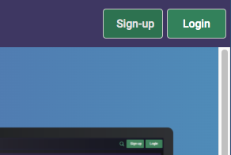

```{r setup, include=FALSE}

library(tidyverse)
library(tidyquant)
library(highcharter)
library(timetk)
library(tibbletime)
library(scales)
library(httr)
library(jsonlite)
library(plotly)
library(here)
library(riingo)

api_key <-  config::get("tiingo", file = "config.yml")

knitr::opts_chunk$set(message=FALSE, 
                      warning=FALSE,
                      comment = NA, 
                      echo = TRUE)
```

### On APIs


Before we plow on, let's unpack that term `API`: it stands for Application Programming Interface. It is a set of rules for how software systems should interact with each other. Right now, we are using R the programming language + RStudio the IDE as one piece of software. 

Somewhere in the land of servers a data provider is storing data in a database, and that's another software system. An API is the set of rules for how our RStudio software interacts with the database software so that we can import the data from the database. One type of API is a `REST` API, and that's the type we'll be focusing on today and in future articles. 

`REST` stands for `RE`presentational `S`tate `T`ransfer. What the heck does that mean for us? It means when someone tries to get information from the API (that someone is called a `client` in the API world, so we're the client), the server will `transfer` a `representation` of the `state` of the information.  

Wait, isn't the server just transferring the data to us when we ask for it? Not really, the original data stays on the server and maybe the data provider has put all sorts of labels on that data, but we don't get those labels, we just get what the provider wants to give us. 

An analogy might be: we go to the registrar of our university and request a copy of our transcripts. The university makes a photocopy of our transcript and gives it to us. But the university keeps the original, and it keeps whatever private stuff has been written about us that isn't supposed to be shared. We haven't gotten our actual full transcript, we've gotten a represenation of the state of that information. If we complete more courses, the state of the information will change. If the copy that's given to us has certain pieces missing or that have become blurry, that's a problem with the API. Possibly it's also a problem with the underlying, raw data. 

There can be slow APIs and fast APIs, just as a university can have a very fast system for retrieving transcripts or a very slow system. An API might limit us to, say 1000 requests per minute. Indeed, the owner of the API can construct whatever rules are desired, but the balance is between usability, speed, resource constraints and cost. That's why when we pay for access to data we are supposed to be paying for faster, more reliable access to data. When an API is free, it comes with constraints. As we'll cover later, many APIs require us to get a token and our access speed and daily allowances are tied to that token.

### R and APIs

The R package we will use to access APIs is the `httr` (pronounced "hitter") package.

For an introduction to accessing APIs via R code and the `httr` package, see [this vignette](https://cran.r-project.org/web/packages/httr/vignettes/quickstart.html).

The main function we'll use is the `GET()` function, since we are going to be getting data from APIs. 

## The Tiingo API {-}

Let's get to the actual API that we'll be using for many our posts and the book that is work in progess: the Tiingo API, which can be found here: [https://api.tiingo.com/](https://api.tiingo.com/]). As with most APIs, to access that end point, you will need to sign up and let the service send you an API key. 

When you click the link above, you should see a place to sign up in the upper righthand corner: 



Go through the steps and check your email for an API key, sometimes called your API token. You will need that token to replicate the code in this project.

## Tiingo API documentation {-}

Most APIs that we wish to access will have documentation to explain how we use the API and retrieve stuff.  

The Tiingo documentation is available [https://api.tiingo.com/documentation/fundamentals](https://api.tiingo.com/documentation/fundamentals). It's a good idea to have a look at that documentation. Not only will it give us instructions on how to import data, it might also alert us to data we didn't know existed. In this case, I did not know that tiingo made daily data on PE Ratios and Market Capitalizations available until reading the documentation. Often times the API documentation will have examples that we can copy/paste and then edit to suit our use case. Those are good days.

### An Example

We will cover this more extensively in other posts, but for now here is a quick example of how to import financial statement data for Apple, from "2018-01-01" through "2020-01-31". 

The very thing we need to do is set up our API key. 

```{r, eval=FALSE}
api_key <- "your api key"
```

Next we need to figure out what the url string is for Apples financial statements. Here it is: 

"https://api.tiingo.com/tiingo/fundamentals/aapl/statements". 

We will need to pass that string, and our API key to the `GET()` function. We also want to specify the format as a CSV, using `format=csv`, and the start and end dates using `startDate=2018-01-01&endDate=2020-01-31`. 

Lastly, we need to append our API key to the string, but remember, we saved our key as a variable called `api_key`, so we can append that variable instead of the actual key. That way, others can't see our key if we deliver our code to them. 

Here is the final composition of the string to be passed to `GET()`.

```{r, eval = FALSE}
str_glue(
"https://api.tiingo.com/tiingo/fundamentals/aapl/statements?format=csv&startDate=2018-01-01&endDate=2020-01-31&token={api_key}"
)
```

We told `str_glue()` that `api_key` is a separate variable by using the curly braces, `{api_key}`.

Now we can pass that glued string to `GET()`.

```{r}
  GET(
  url = str_glue(
    "https://api.tiingo.com/tiingo/fundamentals/aapl/statements?format=csv&startDate=2018-01-01&endDate=2020-01-31&token={api_key}"
  ))
```

Have a look at the results. We were successful in importing the data, but it's not in great shape. 

Let's add one more line of code that can help clean up API calls, the magical `content(as = "parsed")`.

```{r}
 GET(
  url = str_glue(
    "https://api.tiingo.com/tiingo/fundamentals/aapl/statements?format=csv&startDate=2018-01-01&endDate=2020-01-31&token={api_key}"
  )) %>% 
  content(as = "parsed") %>% 
  head()
```

Much better, we now have fundamental data for Apple in a nice tibble format. We have gone from raw data, sitting in Tiingo's databases, accessed via an API call and `GET()` to a nicely structured data frame. 