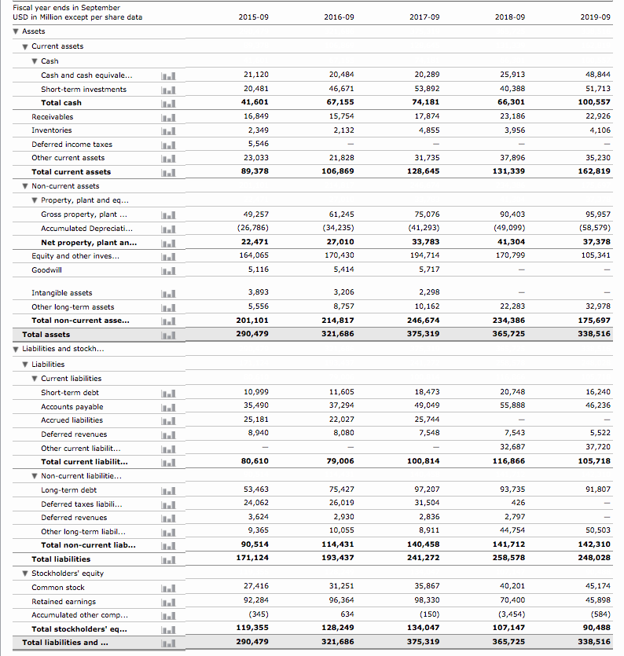
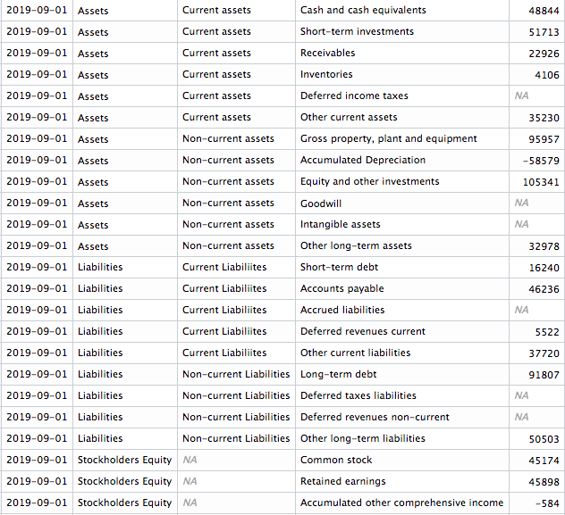
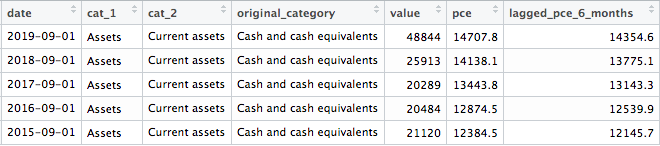

```{r setup, include=FALSE}
knitr::opts_chunk$set(echo = FALSE)
```


# An introduction to quantamental, fundamental and quantitative analysis. 

Welcome to the first post in a series on quantamental analysis, a topic we'll be exploring over the next 6 - 9 months in a series of articles and books. 

The plan or the structure or this series of articles and books will proceed in the following way. First, we will tackle macro investing and strategies. Next, we will cover fundamental data - importing, wrangling and modeling data found on financial statements. We will move to quantitative strategies after this, exploring sector rotation, momentum and smart beta/factors. We conclude by putting it all together to form a quantammental investing framework.

What is fundamental data? 

For our purposes, fundamental data consists of the financial statements of a company: the balance sheet, the statement of cash flows and the income statement. These are reported to the SEC on a quarterly and annual basis and the SEC also has a very helpful primer on what these statements and their components mean.[^1]

[^1]: See here: https://www.sec.gov/reportspubs/investor-publications/investorpubsbegfinstmtguidehtm.html. 

In short, the balance sheet is a snapshot of the assets and liabilities of a company at a moment in time. The income statements tells us how much revenue was earned over a period of time, and how much expense was incurred to generate that revenue. The statement of cash flows reflects the cash inflows and outflows over a period of time, the actual cash that has changed hands with regard to this company.  These three financial statements are linked to one another, of course. For example, Net Income appears at the bottom of Income Statement, and it also the starting point for Cash Flows. Net Income also appears on the Balance Sheet under Retained Earnings. Likewise, Depreciation emanates from the PP&E section of the Balance Sheet and affects the Income Statement as an expense. It gets added back to Net Income in the Cash Flows statement. And, of course cash appears on the Balance Sheet, but the change in cash comes from the previous Cash Flow statement.


For public companies listed in the United States, there is a standard format for how and what to report[^2] 

[^2]: See here https://www.sec.gov/corpfin/cf-manual/topic-1#Topic1_1100). 

Fundamental data is a well-defined, well-structured collection of data. If we tell a colleague that we are working with fundamental data, that colleague will know exactly the names of our variables, how often they were reported (we might say how often they were "observed") and the format in which they have been stored. There is little mystery and creativity around gathering this data.[^3]

[^3]: One could argue that textual analysis of management discussion is part of fundamental analysis and that does involve more creativity. We classify that as outside fundamental analysis and cover it in the NLP chapter.

As we will discuss, though, the standard, well-defined format - meaning the actual shape of the data - does not fit well into quantamental data science techniques and it does require some imagination to reorient this data into a new, dare we say, better, format. 

Here is a snapshot of a traditional Balance Sheet: 


That probably looks very familiar if you've already studied financial modeling or accounting, or have perused company financial statements before. That image is the traditional way to present a company's financials. 

Notice a few things:

    + The dates stretch out wide, across the spreadsheet. That is, each date has its own column. For purposes of quantamental research, that is a problem.
    + There are multiple labels for many of the items. For example, `Cash and cash equivalents` is nested under `Assets`, `Current Assets` and `Cash`, with the exact same label. That will confuse our computer.
    + Various subtotals and `net` calculations appear within the date columns. They reflect those nested labels from the previous bullet point, and sometimes are a result of summing subcategories or subtracting one item from another to get a `net` value.  That is also a problem.

Each of those characteristics makes this data hard to work with from a data science perspective, especially one that involves time series as our work does. If we wish to examine how this balance sheet has changed over time, or how hundreds of balance sheets have changed over time, we will want this data in tidy time series format.  What would that look like? 

Here is a snapshot of that same data, organized in a different way: 

 

The most important change here is the existence of `date` column, which we can also think of as a date index. This will us to plot or analyze the changes in financial variables over time, not just for this firm but for multiple firms on this same time horizon. 

The first snapshot made it easier on our human eyes to scan across multiple years; this second snapshot makes it easier for us to analyze this data as a time series and, very importantly, alongside other macroeconomic or financial time series. 

This format will also allow us to add new data to this data set. For example, perhaps we think that personal consumption expenditure six-months ago is somehow related to Apple's cash on its balance sheet today. To explore that relationship, we can add a column for the economic data. 

Here's a snapshot with monthly peronsal consumption, lagged 6 months, combined with our data. Notce how we align observations to explore relationships.  



We will spend a lot of time on how to get this data into better shape and we hope we can convince the reader of the usefulness of our preferred format, or at least of the usefulness of considering different formats for this data.

From a philosophical perspective, we want to encourage everyone including ourselves to imagine a better format for financial statements.

From a practical perspective, keeping our data in traditional excel or csv format will prevent us from doing the kind of quantamental work that we wish to do in this book. We propose a format based on the principals of tidy data and it's the format we will use throughout this book. That said, there might be other viable structures that fit into the quantitative world just as nicely.

How is this section structured? 


A crucial step in fundamental analysis is getting the data into your RStudio. In some lucky instances, that will be very smooth and easy. The data provider will have stored the data in easy to access format and when you import the data, it will arrive in great shape. When that occurs, it's a function of two things. First, the data must lend itself to a nice and organized structure. Second, the data provider must have taken time and care to organize the data in a nice way. The first precondition is necessary for the second. If the data is too messy or convoluted, the data provider mightn not have an obvious path to making the data intuitively accessible for a broad audience. Remember, thousands of people might be accessing this data, and what's intuitively organized in your opinion might be confusing in my opinion.  Indeed, as you progress through your journey of data importing and wrangling, you might arrive at a point where you prefer data providers make no effort at organizing the data and just deliver you the raw goods. Sometimes it's easier to start from scratch.